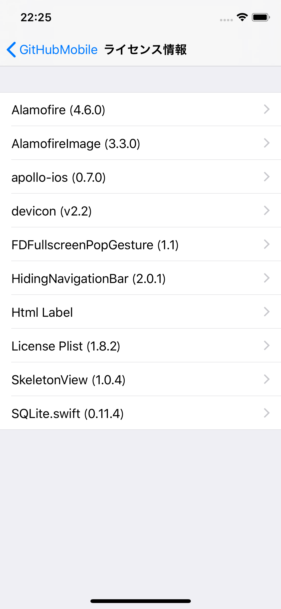

## このiOSアプリについて
このiOSアプリは、現状のiOSアプリのUX改善で利用可能なOSSライブラリや、REST APIに変わると言われているGraphQLの勉強用として、 @zizi4n5 が作成しています。  
興味がある方はぜひ、Forkしていろいろ触ってみてください。  
スターつけていただけると @zizi4n5 が喜びます。


## アプリの機能
このアプリの機能は、以下となります。

1. Swift言語で書かれているGitHubリポジトリの一覧を、Starの多い順にソートして取得・表示することができます。
2. 表示されたリポジトリをタップすることで、アプリ内のUIWebViewでそのリポジトリを確認することができます。


## ビルド方法
このアプリではCarthage、CocoaPodsを利用してOSSライブラリを導入しているため、以下の手順でOSSライブラリのインストールをお願いします。

``` bash
cd ${GitHubMobile展開フォルダ}
carthage bootstrap
pod install
```

## アプリで利用しているOSSの一覧について
アプリインストール後に、以下で確認することができます。  
`iOSの設定アプリ` - `GitHubMobile` - `ライセンス情報`  
<br/>
  
[@mono0926](https://github.com/mono0926) さんの[LicensePlist](https://github.com/mono0926/LicensePlist/blob/master/README.md)を利用しています。  


## 工夫した点
1. 読込速度の改善施策として、GitHubリポジトリデータの取得処理では`REST API`ではなく、これから主流になっていく可能性が高いと言われている`GraphQL API`を採用し、必要な情報のみをGitHubから取得するように対応しています。  
  ※ GitHubはGraphQLへの移行を推奨([Migrating from REST to GraphQL](https://developer.github.com/v4/guides/migrating-from-rest/)）

2. 読込速度の改善施策として、一度に全件取得するのではなく、初回読込時に30件、以降は下方向へのスクロール量によって20件ずつ動的に追加読込して、体感速度の改善を実施しています。

3. UX向上施策として以下の対応を実施しています。  
  ・「[【Swift】少しの手間で出来る！iOS アプリの UX改善 Tips 教えます](https://tech.recruit-mp.co.jp/mobile/ios-ux-tips/)」で紹介されている内容すべてに対応  
  ・スクロール時に（StatusBarは表示したまま）NavigationBarのみを隠して、表示領域を拡大するように対応  

4. OSSのカスタムフォントであるdeviconフォントを組込で、NavigationBarのタイトル表示に利用しています。  


## ライセンス
MIT.
